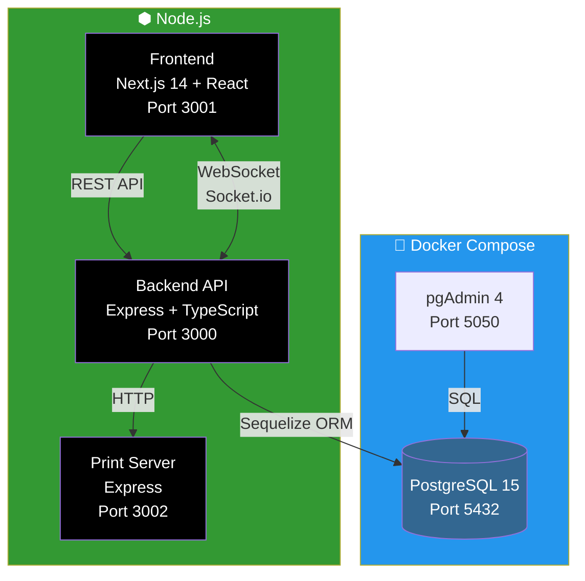

# 🍽️ BistroStreet — Guia d'Execució Local amb Docker i Node.js

## 📖 Índex

1. [Què és BistroStreet?](#1-què-és-bistrostreet)
2. [Arquitectura del Sistema](#2-arquitectura-del-sistema)
3. [Requisits Previs](#3-requisits-previs)
4. [Instal·lació Pas a Pas](#4-instal·lació-pas-a-pas)
5. [Accés a les Interfícies](#5-accés-a-les-interfícies)
6. [Comandes Útils](#6-comandes-útils)
7. [Estructura del Projecte](#7-estructura-del-projecte)
8. [Resolució de Problemes](#8-resolució-de-problemes)

---

## 1. 📋 Què és BistroStreet?

BistroStreet és un **sistema web dual per a restaurants** que combina dues interfícies en una sola aplicació:

| Interfície | Descripció | Usuaris |
|---|---|---|
| **Client (E-commerce)** | Menú categoritzat, cistella de compra, checkout amb modes Local/Recollida/Delivery | Clients del restaurant |
| **TPV (Punt de Venda)** | Dashboard operatiu, gestió de comandes en temps real, mapa de taules, arqueig de caixa | Cambrers i administradors |

### ✨ Funcionalitats principals

- 🛒 **Comandes en línia** — Menú amb categories, cistella flotant i checkout complet
- 📊 **Dashboard TPV** — Gestió operativa amb mapa de taules interactiu
- ⚡ **Temps real** — Sincronització instantània via WebSocket entre client i TPV
- 🖨️ **Impressió tèrmica** — Integració amb impressora POS-58mm
- 🧾 **Facturació automàtica** — Factures amb numeració correlativa i desglossament d'IVA
- 📦 **Control d'estoc** — Escandallos que descompten ingredients automàticament
- 🎁 **Programa de fidelitat** — Sistema de punts i recompenses per a clients

---

## 2. 🏗️ Arquitectura del Sistema

L'aplicació utilitza una arquitectura de **3 serveis + base de dades**, tot gestionat localment:



### Stack tecnològic

| Capa | Tecnologia | Descripció |
|---|---|---|
| **Frontend** | Next.js 14 + React + TypeScript | Renderitzat del costat del servidor (SSR), rutes App Router |
| **Backend** | Express + TypeScript + Sequelize | API REST, autenticació JWT, WebSocket amb Socket.io |
| **Base de dades** | PostgreSQL 15 (Docker) | Base de dades relacional amb migracions automàtiques |
| **Impressió** | Print Server + ESC/POS | Servei local per a impressores tèrmiques USB |
| **Estils** | CSS Modules | Estils encapsulats per component |

---

## 3. ✅ Requisits Previs

Abans de començar, assegura't de tenir instal·lat:

| Requisit | Versió mínima | Com verificar |
|---|---|---|
| **Node.js** | ≥ 18.0.0 | `node --version` |
| **npm** | ≥ 9.0.0 | `npm --version` |
| **Docker** | Qualsevol recent | `docker --version` |
| **Docker Compose** | v2+ | `docker compose version` |
| **Git** | Qualsevol | `git --version` |

### Instal·lació dels requisits (Ubuntu/Debian)

```bash
# Node.js 18+ (via NodeSource)
curl -fsSL https://deb.nodesource.com/setup_18.x | sudo -E bash -
sudo apt-get install -y nodejs

# Docker
curl -fsSL https://get.docker.com | sudo sh
sudo usermod -aG docker $USER
# ⚠️ Tanca sessió i torna a entrar perquè el grup docker sigui efectiu
```

---

## 4. 🚀 Instal·lació Pas a Pas

### Pas 1 — Clonar el repositori

```bash
git clone <URL-del-repositori>
cd bistrostreet
```

### Pas 2 — Crear fitxers d'entorn

Copia els fitxers d'exemple `.env.example` a fitxers `.env` reals:

```bash
# Backend
cp backend/.env.example backend/.env

# Frontend
cp frontend/.env.example frontend/.env.local

# Print Server (opcional, només si tens impressora tèrmica)
cp print-server/.env.example print-server/.env
```

> [!NOTE]
> Els fitxers `.env.example` ja contenen valors per defecte que funcionen en mode desenvolupament. No cal modificar-los per a una execució local bàsica.

### Pas 3 — Aixecar la base de dades amb Docker

```bash
npm run db:up
```

Això executa `docker compose up -d` que inicia:

| Contenidor | Imatge | Port | Descripció |
|---|---|---|---|
| `restaurant_tpv_db` | `postgres:15-alpine` | 5432 | Base de dades PostgreSQL |
| `restaurant_tpv_pgadmin` | `dpage/pgadmin4` | 5050 | Interfície web d'administració de BD |

Verifica que estan corrents:

```bash
docker compose ps
```

### Pas 4 — Instal·lar dependències

```bash
npm run install:all
```

Això instal·la les dependències de les 3 parts del projecte: backend, frontend i print-server.

### Pas 5 — Executar migracions i dades inicials

```bash
# Crear les taules a la base de dades
npm run db:migrate

# Poblar amb dades de demostració (categories, productes, usuaris)
npm run db:seed
```

### Pas 6 — Iniciar els servidors de desenvolupament

```bash
npm run dev
```

Això inicia **3 servidors simultàniament** amb `concurrently`:

| Servei | URL | Log prefix |
|---|---|---|
| **Backend API** | http://localhost:3000 | `[0]` |
| **Frontend** | http://localhost:3001 | `[1]` |
| **Print Server** | http://localhost:3002 | `[2]` |

> [!TIP]
> Si vols executar només un servei individualment:
> ```bash
> npm run dev:backend   # Només el backend
> npm run dev:frontend  # Només el frontend
> npm run dev:print     # Només el print server
> ```

---

## 5. 🖥️ Accés a les Interfícies

Un cop tots els serveis estan en marxa, pots accedir a:

### 🍔 Interfície Client — `http://localhost:3001`

Interfície pública pels clients del restaurant. Mostra el menú per categories, permet afegir productes a la cistella i fer comandes.


### 📱 Interfície TPV — `http://localhost:3001/tpv`

Panel d'administració per a cambrers i administradors. Requereix autenticació.


**Credencials per defecte:**

| Usuari | Contrasenya | Rol | Permisos |
|---|---|---|---|
| `admin` | `admin123` | Administrador | Accés total: dashboard, gestió de comandes, arqueig de caixa, configuració |
| `camarero1` | `camarero1` | Cambrer | Gestió de comandes, mapa de taules |

### 🗄️ pgAdmin — `http://localhost:5050`

Interfície web per administrar directament la base de dades PostgreSQL.

**Credencials:** `admin@admin.com` / `admin`

Per connectar-se a la BD des de pgAdmin:
1. Clic a **Add New Server**
2. **Name**: `BistroStreet` (qualsevol nom)
3. Pestanya **Connection**:
   - **Host**: `postgres` (nom del contenidor Docker)
   - **Port**: `5432`
   - **Database**: `restaurant_tpv`
   - **Username**: `admin`
   - **Password**: `admin123`

---

## 6. 🛠️ Comandes Útils

### Gestió de Docker (Base de Dades)

| Comanda | Descripció |
|---|---|
| `npm run db:up` | Aixecar contenidors PostgreSQL + pgAdmin |
| `npm run db:down` | Aturar i eliminar contenidors |
| `docker compose ps` | Veure estat dels contenidors |
| `docker compose logs postgres` | Veure logs de PostgreSQL |

### Gestió de la Base de Dades

| Comanda | Descripció |
|---|---|
| `npm run db:migrate` | Executar migracions pendents |
| `npm run db:seed` | Executar seeders (dades inicials) |
| `cd backend && npx sequelize-cli db:migrate:undo` | Desfer última migració |

### Desenvolupament

| Comanda | Descripció |
|---|---|
| `npm run dev` | Iniciar tots 3 servidors |
| `npm run dev:backend` | Iniciar només el backend |
| `npm run dev:frontend` | Iniciar només el frontend |
| `npm run dev:print` | Iniciar només el print server |

### Testing

```bash
# Tests del backend
cd backend && npm test

# Tests del frontend
cd frontend && npm test
```

---

## 7. 📁 Estructura del Projecte

```
bistrostreet/
├── backend/                  # 🔧 API REST + WebSocket
│   ├── src/
│   │   ├── controllers/      #   Lògica de negoci per ruta
│   │   ├── models/           #   Models Sequelize (ORM)
│   │   ├── routes/           #   Definició de rutes Express
│   │   ├── middleware/       #   Auth JWT, CORS, rate-limiting
│   │   ├── services/         #   Serveis (WhatsApp, impressió)
│   │   └── server.ts         #   Punt d'entrada del servidor
│   ├── migrations/           #   Migracions de BD (esquema)
│   ├── seeders/              #   Dades inicials (demo)
│   ├── config_db.js          #   Configuració de connexió a BD
│   └── .env                  #   Variables d'entorn backend
│
├── frontend/                 # 🎨 Next.js 14 App
│   ├── src/
│   │   ├── app/              #   Pàgines (App Router)
│   │   │   ├── menu/         #     Menú del client
│   │   │   └── tpv/          #     Interfície TPV
│   │   ├── components/       #   Components React reutilitzables
│   │   ├── context/          #   Context API (estat global)
│   │   └── styles/           #   CSS Modules
│   └── .env.local            #   Variables d'entorn frontend
│
├── print-server/             # 🖨️ Servei d'impressió tèrmica
│   ├── src/
│   │   └── server.ts         #   Servidor ESC/POS per impressora USB
│   └── .env                  #   Variables d'entorn print server
│
├── docker-compose.yml        # 🐳 PostgreSQL + pgAdmin
├── package.json              # 📦 Workspace root (scripts globals)
└── docs/                     # 📚 Documentació
```

---

## 8. 🔧 Resolució de Problemes

### ❌ Error: `port 5432 already in use`

Un altre servei PostgreSQL ja ocupa el port. Solucions:

```bash
# Opció 1: Aturar el PostgreSQL local
sudo systemctl stop postgresql

# Opció 2: Canviar el port al docker-compose.yml
# Canvia "5432:5432" per "5433:5432" i actualitza DB_PORT al .env
```

### ❌ Error: `EACCES permission denied` amb Docker

```bash
# Afegeix el teu usuari al grup docker
sudo usermod -aG docker $USER
# Tanca sessió i torna a entrar
```

### ❌ Error de migració: `foreign key constraint`

Si una migració falla per restriccions de claus foranes, és probable que les dades inicials (seeders) no s'hagin executat encara:

```bash
# Executa primer totes les migracions
npm run db:migrate

# Després els seeders
npm run db:seed
```

### ❌ Error: `Cannot find module` o dependències no trobades

```bash
# Reinstal·la totes les dependències
npm run install:all
```

### ❌ El frontend no connecta amb el backend

Verifica que el fitxer `frontend/.env.local` conté:

```
NEXT_PUBLIC_API_URL=http://localhost:3000
NEXT_PUBLIC_WS_URL=http://localhost:3000
```

### 🔄 Reiniciar tot des de zero

Si necessites començar de nou amb una base de dades neta:

```bash
# Atura tot
npm run db:down

# Elimina el volum de dades
docker volume rm bistrostreet_postgres_data

# Torna a començar
npm run db:up
npm run db:migrate
npm run db:seed
npm run dev
```

---

## 📝 Resum ràpid (TL;DR)

```bash
# 1. Configura entorn
cp backend/.env.example backend/.env
cp frontend/.env.example frontend/.env.local
cp print-server/.env.example print-server/.env

# 2. Aixeca la BD
npm run db:up

# 3. Instal·la dependències
npm run install:all

# 4. Prepara la BD
npm run db:migrate
npm run db:seed

# 5. Engega!
npm run dev
```

Accedeix a: **http://localhost:3001** (Client) · **http://localhost:3001/tpv** (TPV, login: admin/admin123)